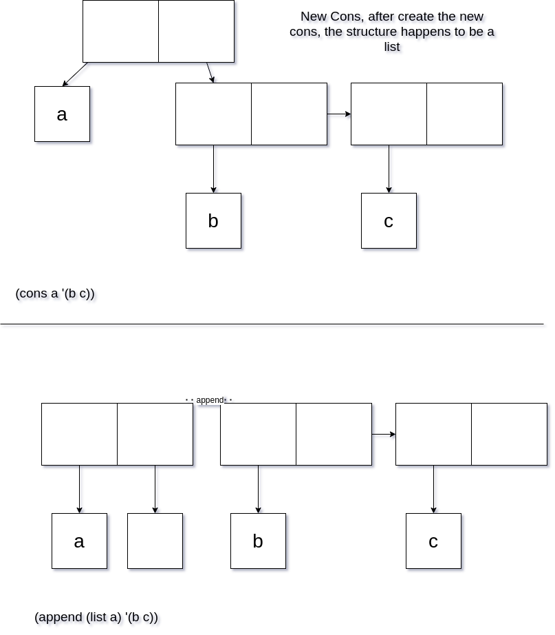

# Chapter 02
- cons and list
    - a cons includes two boxes, each one points to an item
    - list generate a linked list with parameters directly
    - why (cons a '(b c)) is equal to (append '(a) '(b c)) but (cons '(b c) a) is not equal to (append '(b c) '(a))

        
